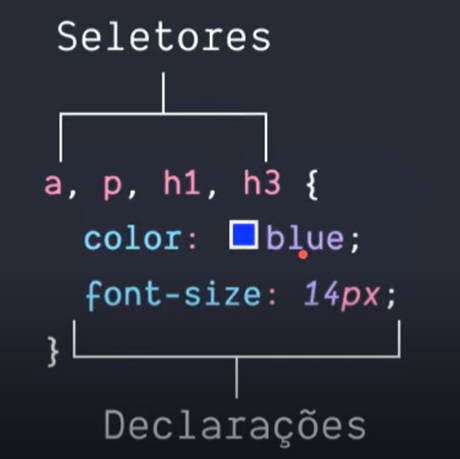

# Conceitos Básicos CSS3

## Seletores e Declarações

<section align="center">

</section>

Uma regra CSS é representada por um seletor ou um grupo de seletores, no nosso caso é o '<\a>', então dentro de um par de chaves adicionamos as declarações, no exemplo acima estamos alterando cor e tamanho da fonte dessa âncora, as declarações são formadas por uma propriedade e um valor.  Percebam que podemos colocar vários seletores em uma regra separando-os por vírgula.
E há um último detalhe nesse exemplo: a pseudo-classe.   Elementos HTML sofrem alterações causadas pela interação do usuário, como mover o mouse por cima ou clicar nesse elemento.  
O 'a:hover' do exemplo significa que a âncora também terá essa aparência quando o usuário passar o mouse por cima de um hyperlink.

