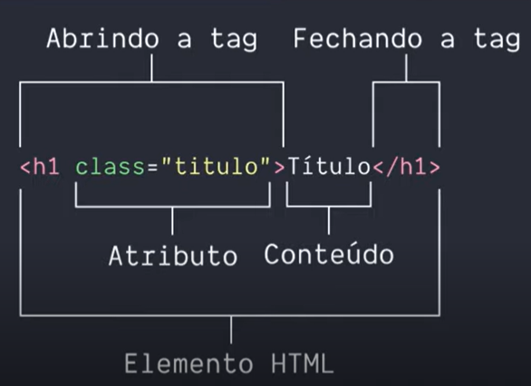

# Conceitos básicos de HTML

- ### Elemento HTML    



### Estrutura básica 

```
<!DOCTYPE html>  
<html>  
    <head> 
        <meta>  
        <title></title> 
    </head>
    <body>
    </body>
</html>
```
## \<!DOCTYPE html>
Diz ao navegador que ele está lidando com um arquivo do tipo HTML5

## \<html>
A tag html é a raiz do seu documento, todos os elementos HTML devem estar dentro dela. E nela nós informamos ao navegador qual é o idioma desse nosso documento, através do atributo lang, para o português brasileiro usamos pt-BR. (\<html lang="pt-br">)

## \<head>
Contém elementos que serão lidos pelo navegador, como os metadados - um exemplo é o charset, que é a codificação de caracteres e a mais comum é a UTF-8, o JavaScript com a tag script, o CSS através das tags style e link

## \<body>
Dentro da tag body colocamos todo o conteúdo visível ao usuário: textos, imagens, vídeos.

---
---
---
# ***Semântica***
A semântica nos permite descrever mais precisamente o nosso conteúdo, agora um bloco de texto não é apenas uma div, agora é um article e tem mais significado assim.

## \<section>
Representa uma seção genérica de conteúdo quando não houver um elemento mais específico para isso.

## \<header>
É o cabeçalho da página ou de uma seção da página e normalmente contém logotipos, menus, campos de busca.

## \<article>
Representa um conteúdo independente e de maior relevância dentro de uma página, como um post de blog, uma notícia em uma barra lateral ou um bloco de comentários. Um article pode conter outros elementos, como header, cabeçalhos, parágrafos e imagens.

## \<aside>
É uma seção que engloba conteúdos relacionados ao conteúdo principal, como artigos relacionados, biografia do autor e publicidade. Normalmente são representadas como barras laterais.

## \<footer>
Esse elemento representa o rodapé do conteúdo ou de parte dele, pois ele é aceito dentro de vários elementos, como article e section e até do body. Exemplos de conteúdo de um \<footer> são informações de autor e links relacionados.

## \<h1>-\<h6>
Eles não foram criados na versão 5 do HTML e nem são específicos para semântica, mas servem para esse propósito. São utilizados para marcar a importância dos títulos, sendo \<h1> o mais importante e \<h6> o menos. Uma dica: use apenas um \<h1> por página, pois ele representa o objetivo da sua página. 

---
---
---

# ***Textos e links***

Textos
## \<p>
Representa um parágrafo, mas ele não suporta apenas texto, podemos adicionar imagens, código, vídeos e vários outros tipos de conteúdo dentro dele.

hyperlink

## \<a>
Significa anchor/âncora, ele representa um hyperlink, é ele que interliga vários conteúdos e páginas na web. O elemento a tem vários atributos, mas vamos focar em dois, o href e o target.
### href
Representa o hyperlink para onde sua âncora aponta, pode ser uma página do seu ou de outro site, um e-mail e até mesmo um telefone, os dois últimos precisam dos prefixos mailto: e tel:, respectivamente.

### target
Serve para abrir nossos links em outra aba do navegador usando o valor _blank. (\<a href="mailto:lucas@vilaboim.com" target="_blank">lucas@vilaboim.com\</a>)

---
---
---

# ***Listas***
Listas servem para agrupar uma coleção de itens, como uma lista de ingredientes ou, como será no nosso caso, uma lista com contatos.
## \<ul>
Cria uma lista não ordenada, onde a ordem dos elementos não é importante, e é representada com pontos, círculos ou quadrados.

## \<ol>
Serve para criar lista ordenadas, nessas a ordem importa, portanto elas são representadas com números, algarismos romanos ou letras.

## \<li>
É um item dentro de uma dessas listas. Um \<li> pode conter vários tipos de conteúdos, como parágrafos, imagens e até outras listas.